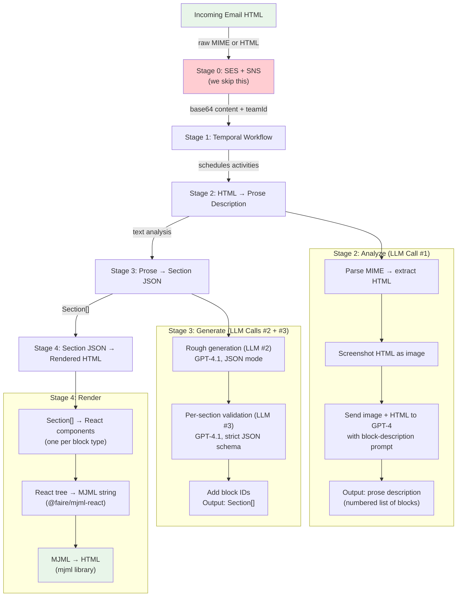
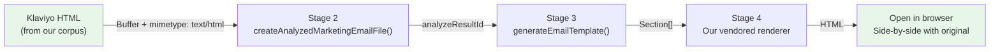

# How the Redo Email Duplicator Works — End to End

This doc explains the entire system: how Redo's production email forwarder turns HTML into a visual email template, and how our internal duplicator tool will reuse it. Start here if you're new to the codebase.

---

## The Big Picture



**Green boxes** = what we care about (input HTML, output HTML).  
**Red box** = what we skip (the SES/SNS infrastructure).  
**Everything in between** = the actual work.

---

## Technology Primer

### What is Temporal?

Temporal is a **workflow engine**. Think of it as a way to run multi-step processes that can survive crashes, retries, and timeouts. Instead of writing code like:

```js
// Fragile — if step 2 crashes, you've got a dangling empty template
const template = await createEmptyTemplate(teamId);
const analysis = await analyzeEmail(content);
const sections = await generateSections(analysis);
await saveTemplate(template, sections);
```

You write it as a Temporal **workflow** with **activities**:

```js
// Temporal handles retries, timeouts, and cleanup automatically
export async function processForwardedEmail({ teamId, contentBuffer }) {
  const { savedTemplateId } = await activity("createEmptyTemplate", { teamId });
  const { analyzeResultId } = await activity("analyzeForwardedEmail", { teamId, contentBuffer });
  const { sections } = await activity("generateTemplateContent", { teamId, analyzeResultId });
  await activity("saveGeneratedTemplate", { teamId, savedTemplateId, sections });
}
```

Key concepts:
- **Workflow** = the orchestrator. Defines the order of steps. Runs on the Temporal server.
- **Activity** = a single step (function call). Can timeout, retry, fail independently.
- **Task Queue** = a named channel. Workers poll it for work. Redo uses `MARKETING_NAMESPACE_DEFAULT`.

**Why Redo uses it here:** The email duplication involves two expensive LLM calls (30-120s each). If the server dies mid-way, Temporal resumes from the last completed activity. It also gives timeout/retry semantics per-step — the analysis gets 5 minutes and 3 retries.

**For our tool:** We don't need Temporal. We'll call the same functions directly in sequence. If something fails, we just re-run.

### What is MJML?

MJML stands for "Mailjet Markup Language." It's a markup language specifically for writing **responsive emails**.

Email HTML is notoriously awful:
- Every email client renders differently (Gmail vs Outlook vs Apple Mail vs Yahoo)
- You can't use modern CSS (no flexbox, no grid, limited media queries)
- Everything has to be done with nested `<table>` elements
- You need MSO conditional comments (`<!--[if mso]>`) for Outlook

MJML abstracts all of that. You write clean components:

```xml
<mjml>
  <mj-body>
    <mj-section background-color="#ffffff">
      <mj-column>
        <mj-text font-size="20px" color="#333">Hello World</mj-text>
        <mj-button href="https://example.com">Click Me</mj-button>
      </mj-column>
    </mj-section>
  </mj-body>
</mjml>
```

And MJML compiles it to ~200 lines of cross-client-compatible HTML with all the table nesting, Outlook conditionals, and responsive media queries baked in.

**The Redo rendering pipeline uses MJML through React:**
1. Each Redo block type (TEXT, BUTTON, IMAGE, etc.) is a React component that outputs MJML elements
2. `@faire/mjml-react` lets you write MJML as JSX: `<MjmlText>` instead of `<mj-text>`
3. `renderToMjml()` turns the React tree into an MJML string
4. `mjml2html()` compiles MJML to final HTML

So: `Section[] → React/MJML components → MJML XML string → HTML`

### What is the Redo Block Schema?

Redo's email builder (the drag-and-drop editor merchants use) doesn't store emails as HTML. It stores them as **structured JSON** — an array of "sections" (blocks). This is the `Section[]` type.

Each section has a `type` field that determines its shape:

```json
{
  "sections": [
    {
      "type": "header",
      "blockId": "abc123",
      "headerType": "logo",
      "imageUrl": "https://...",
      "layout": "center",
      "sectionPadding": { "top": 10, "right": 0, "bottom": 10, "left": 0 },
      "sectionColor": "#ffffff"
    },
    {
      "type": "text",
      "blockId": "def456",
      "text": "<p><span style=\"font-size: 24px;\">Welcome!</span></p>",
      "textColor": "#333333",
      "fontSize": 16,
      "fontFamily": "Arial",
      "linkColor": "#0066cc",
      "sectionPadding": { "top": 20, "right": 40, "bottom": 20, "left": 40 },
      "sectionColor": "#ffffff"
    },
    {
      "type": "button",
      "blockId": "ghi789",
      "buttonText": "Shop Now",
      "buttonLink": "https://example.com",
      "fillColor": "#000000",
      "textColor": "#ffffff",
      "cornerRadius": 4,
      "alignment": "center",
      "sectionPadding": { "top": 20, "right": 0, "bottom": 20, "left": 0 },
      "sectionColor": "#ffffff"
    },
    {
      "type": "spacer",
      "blockId": "jkl012",
      "height": 40,
      "sectionPadding": { "top": 0, "right": 0, "bottom": 0, "left": 0 },
      "sectionColor": "#ffffff"
    }
  ]
}
```

There are **11 block types the AI can produce** (out of ~25 total):

| Type | What it is | Key fields |
|------|-----------|------------|
| `TEXT` | Rich text paragraph(s) | `text` (HTML string with `<p>`, `<span>` tags), `fontSize`, `fontFamily`, `textColor` |
| `IMAGE` | Standalone image | `imageUrl`, `altText`, `clickthroughUrl`, `aspectRatio` |
| `BUTTON` | Call-to-action button | `buttonText`, `buttonLink`, `fillColor`, `textColor`, `cornerRadius` |
| `HEADER` | Logo/image header | `headerType` (image/logo/text), `imageUrl`, `text`, `layout` |
| `SPACER` | Vertical whitespace | `height` (pixels) |
| `LINE` | Horizontal divider | `color`, `padding` |
| `COLUMN` | Multi-column layout | `columns` (array of other blocks), `columnCount`, `gap`, `stackOnMobile` |
| `MENU` | Navigation links | `menuItems` (array of `{id, label}`), `linkColor` |
| `SOCIALS` | Social media icons | `socialLinks` (array of `{platform, url}`), `iconColor` |
| `DISCOUNT` | Promo/discount code | `fontFamily`, `textColor`, `blockBackgroundColor` |
| `SHOPPABLE_PRODUCTS` | Interactive product cards | Complex — deferred |

Every block shares a base: `blockId`, `sectionPadding` (top/right/bottom/left), `sectionColor` (background).

**The key rule:** `COLUMN` is the only recursive block. A column contains an array of non-recursive blocks (text, image, button, etc.). You CANNOT nest a column inside a column.

---

## Concrete Walkthrough: One Real Email Through the Pipeline

Let's trace what happens when the Klaviyo template **"Newsletter #1 (Images & Text)"** from QuikCamo goes through the duplicator. This is a real template from our extracted corpus (`migrations/test-account/templates/Lgdf7J-newsletter-1-images-text.html`).

### The Input: Klaviyo HTML

The HTML is ~25KB of deeply nested table-based email markup. Here's what it actually looks like visually:

```
┌──────────────────────────────────────────┐
│  [QuikCamo Logo]                         │  ← logo image, centered
│  SHOP NOW                                │  ← navigation link
├──────────────────────────────────────────┤  ← thick dark line
│  This template starts with images.       │  ← headline text
├────────────┬────────────┬────────────────┤
│  [Image]   │  [Image]   │  [Image]       │  ← 3-column image gallery
├────────────┴────────────┴────────────────┤
│  Everyone loves pictures. They're more   │
│  engaging than text by itself...         │  ← body text (multiple paragraphs)
│  Happy emailing!                         │
│  The Klaviyo Team                        │
├──────────────────────────────────────────┤
│  [FB] [Pinterest] [Instagram]            │  ← social icons
│  Unsubscribe · Address · etc.            │  ← footer
└──────────────────────────────────────────┘
```

The actual HTML is a mess of `<table>`, `<td>`, MSO conditionals, Klaviyo-specific classes (`kl-row`, `kl-column`, `kl-text`), and inline styles. A human could read it but it's not structured data — it's display markup.

### Stage 2: HTML → Prose Description (LLM Call #1)

**What happens:**
1. The HTML buffer is passed to `createAnalyzedMarketingEmailFile()`
2. Since it's already `text/html` (not an EML), it skips the MIME parser
3. `getFileSource()` converts the HTML to an image (screenshot) for the vision model
4. Both the image AND the raw HTML are sent to the LLM

**The system prompt** tells the LLM:
- "You are describing files for an email builder tool"
- "Break the email into a list of structured blocks"
- Lists the 9 available block types with examples
- Emphasizes rules like: "side-by-side = COLUMN", "no nested COLUMNs", "discount codes never in TEXT"

**What the LLM would output** (this is approximate — we'd need to actually run it):

```
1. HEADER – Logo image: QuikCamo logo
   (https://d3k81ch9hvuctc.cloudfront.net/.../7478f29e-...png),
   centered, width 300px, white background, padding 9px

2. MENU – Single item: "SHOP NOW" linking to http://quikcamo.com/
   Font: Helvetica Neue 14px, color #3d3935, centered

3. LINE – Solid 4px border, color #3d3935, full width

4. TEXT – Heading: "This template starts with images."
   Bold, 24px, Helvetica Neue, color #3d3935, left-aligned
   Padding: 18px top, 15px left/right

5. COLUMN – 3-column layout, equal widths (33.33% each)
   - Column 1: IMAGE – placeholder (no src), 164px wide
   - Column 2: IMAGE – placeholder (no src), 164px wide
   - Column 3: IMAGE – placeholder (no src), 164px wide
   Padding: 9px all around each column

6. TEXT – Body paragraphs:
   "Everyone loves pictures..." (multiple paragraphs)
   14px, Helvetica Neue, color #3d3935, line-height 1.3
   Padding: 18px top/bottom, 15px left/right

7. SOCIALS – 3 social links, centered:
   - Facebook: https://www.facebook.com/Quikcamo/
   - Pinterest: https://www.pinterest.com/QuikCamo/
   - Instagram: https://www.instagram.com/quikcamo/
   Icon style: subtle, 48px, gray background (#f7f7f7)

8. TEXT – Footer: "No longer want to receive these emails?..."
   11px, centered, color #222222, gray background (#f7f7f7)
```

This prose description is stored in the database along with the uploaded HTML.

**Key insight:** This first LLM call is doing *visual understanding* — it's looking at an image of the email AND reading the HTML source. Its job is to identify the structure (what blocks, in what order, with what content). It does NOT output JSON — it outputs natural language.

**Why not go straight to JSON?** Two reasons:
1. The LLM needs to "think" about the structure first. Having it describe what it sees produces better reasoning than jumping straight to a rigid schema.
2. The prose can be reviewed by humans. If the JSON is wrong, you can read the prose to see where the understanding went wrong.

### Stage 3: Prose → Section[] JSON (LLM Calls #2 and #3)

This stage has two sub-steps.

**Step 3.1: Rough Generation (LLM Call #2)**

The prose description from Stage 2 is sent to GPT-4.1 along with:
- A system prompt listing every block type and its properties
- The original HTML again (re-injected for reference)
- Instructions to output `{ "sections": [...] }` as JSON

**Output** (approximate):

```json
{
  "sections": [
    {
      "type": "header",
      "headerType": "logo",
      "layout": "center",
      "imageUrl": "https://d3k81ch9hvuctc.cloudfront.net/.../7478f29e-...png",
      "text": "",
      "textColor": "#3d3935",
      "fontSize": 14,
      "fontFamily": "Helvetica Neue, Arial",
      "logoHeight": 50,
      "imageHeight": 50,
      "sectionColor": "#ffffff",
      "sectionPadding": { "top": 9, "right": 14, "bottom": 0, "left": 14 }
    },
    {
      "type": "text",
      "text": "<p style=\"text-align: center;\"><a href=\"http://quikcamo.com/\" style=\"font-size: 14px; color: #3d3935; text-decoration: none;\">SHOP NOW</a></p>",
      "textColor": "#3d3935",
      "fontSize": 14,
      "fontFamily": "Helvetica Neue, Arial",
      "linkColor": "#3d3935",
      "sectionColor": "#ffffff",
      "sectionPadding": { "top": 0, "right": 15, "bottom": 0, "left": 15 }
    },
    ...more sections...
  ]
}
```

This JSON is **close but not perfect**. Field names might be slightly off, padding values might be inconsistent, some required fields might be missing. That's why there's a second pass.

**Step 3.2: Per-Section Validation (LLM Call #3 — actually N calls in parallel)**

Each section from the rough output is individually re-processed:

1. Take one section (e.g., the header)
2. Create a system prompt: "You are a JSON validator. This is a HEADER section. Here are the exact required fields..."
3. Provide the section's actual **Zod schema** (converted to JSON Schema with `strict: true`)
4. Ask GPT-4.1 to output a corrected version that exactly matches the schema
5. OpenAI's structured output mode (`responseFormat: json_schema`) guarantees the output conforms to the schema

This runs in parallel for all sections. Any section that fails validation is **silently dropped** (returns null, gets filtered out).

For COLUMN sections, the nested blocks inside the column are recursively validated the same way.

**Output:** A properly-typed `Section[]` array where every field matches the Zod schema.

**Step 3.3: Add Block IDs**

Each section gets a unique `blockId` stamped on it (MongoDB ObjectId). This is how the editor tracks individual blocks.

### Stage 4: Section[] → Rendered HTML

This is what our vendored renderer does. The pipeline:

```
Section[]
  ↓  (for each section, look up React component by type)
React component tree
  ↓  (each component outputs MJML JSX: <MjmlSection>, <MjmlColumn>, <MjmlText>, etc.)
MJML JSX tree
  ↓  renderToMjml() — @faire/mjml-react
MJML XML string
  ↓  mjml2html() — mjml library
Final HTML string (cross-client compatible)
```

Example — a TEXT section flows through like this:

```
Section: { type: "text", text: "<p>Hello</p>", fontSize: 16, ... }
  ↓
React: <MjmlSection><MjmlColumn><MjmlText>Hello</MjmlText></MjmlColumn></MjmlSection>
  ↓
MJML: <mj-section><mj-column><mj-text>Hello</mj-text></mj-column></mj-section>
  ↓
HTML: <table><tr><td style="...">Hello</td></tr></table> (with all the client-compat wrapping)
```

---

## What We're Building: The Internal Duplicator Tool



We take the Klaviyo HTML we already extracted (388 templates), feed it through the same AI pipeline Redo's forwarder uses, get back `Section[]`, then render it with our vendored renderer. We can visually compare the rendered output against the original Klaviyo HTML.

**What we're reusing from Redo:** Stages 2 and 3 (the LLM-powered analysis and generation).  
**What we built ourselves:** Stage 4 renderer (vendored into `mime/src/renderer/`).  
**What we skip entirely:** Stage 0 (SES/SNS) and Stage 1 (Temporal orchestration).

---

## The Weaknesses We Want to Measure

Now that you understand the full pipeline, here are the specific things that can go wrong:

1. **Lossy two-call pipeline** — Stage 2 turns HTML into prose, Stage 3 turns prose back into structured JSON. The original HTML IS re-injected into Stage 3, but the LLM is still primed by the potentially-lossy prose summary. Exact pixel values, column width ratios, and font stacks often drift.

2. **Silent section drops** — In Stage 3.2, if a section fails Zod validation, it's silently dropped. We have no visibility into how often this happens. An email with 8 blocks might come back with 6 and nobody notices.

3. **Image URL hallucination** — The Stage 2 prompt asks the LLM to "include original URLs from the HTML where available." It's relying on the LLM to copy-paste URLs correctly. A deterministic HTML parser (cheerio) would do this with zero risk.

4. **No ground truth comparison** — There's no eval harness. When you forward an email today, nobody checks if the output looks like the input. The Klaviyo corpus gives us 388 ground-truth inputs to build that comparison.

5. **Style contamination via `keepExistingStyles`** — The Stage 3 code optionally fetches the merchant's last 2 campaigns and includes them in the prompt for "brand consistency." This can bleed styles from completely unrelated emails.
